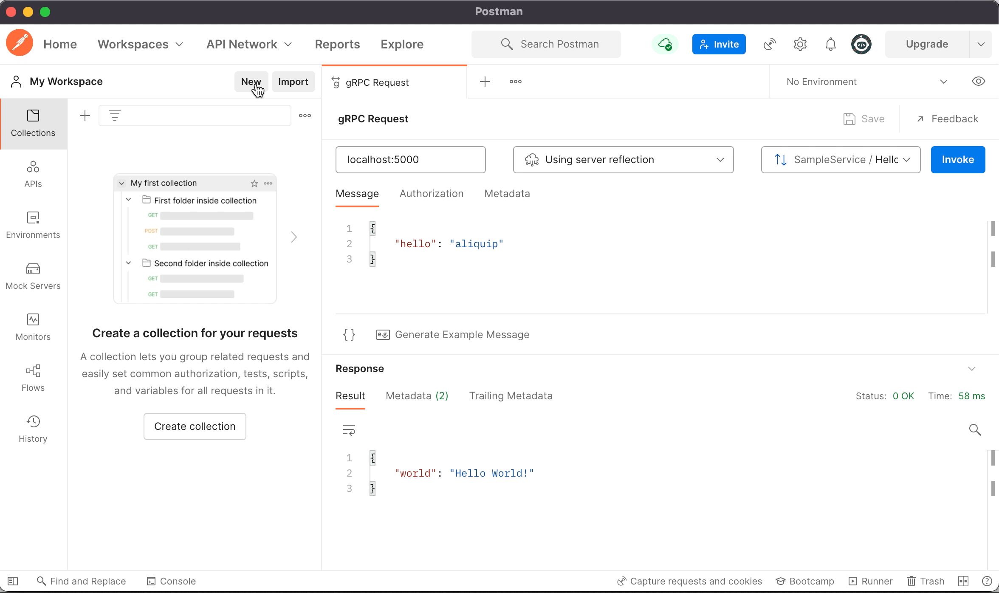

# gRPC Reflection

gRPC reflection API service for use with gRPC-node.

## Background

This package provides an implementation of the [gRPC Server Reflection Protocol](https://github.com/grpc/grpc/blob/master/doc/server-reflection.md) service which can be added to an existing gRPC server. Adding this service to your server will allow clients [such as postman](https://blog.postman.com/postman-now-supports-grpc/) to dynamically load the API specification from your running application rather than needing to pass around and load proto files manually.



## Installation

Use the package manager [npm](https://www.npmjs.com/get-npm) to install `@grpc/reflection`.

```bash
npm install @grpc/reflection
```

## Usage

Any gRPC-node server can use `@grpc/reflection` to expose reflection information about their gRPC API. 

```typescript
import { ReflectionService } from '@grpc/reflection';

const pkg = protoLoader.load(...); // Load your gRPC package definition as normal

// Create the reflection implementation based on your gRPC package and add it to your existing server
const reflection = new ReflectionService(pkg);
reflection.addToServer(server);
```

Congrats! Your server now allows any client to request reflection information about its API.

## Contributing

Pull requests are welcome. For major changes, please open an issue first to discuss what you would like to change. The original proposal for this library can be found in [gRFC L108](https://github.com/grpc/proposal/blob/master/L108-node-grpc-reflection-library.md)

Please make sure to update tests as appropriate.

## License
[Apache License 2.0](https://choosealicense.com/licenses/apache-2.0/)
